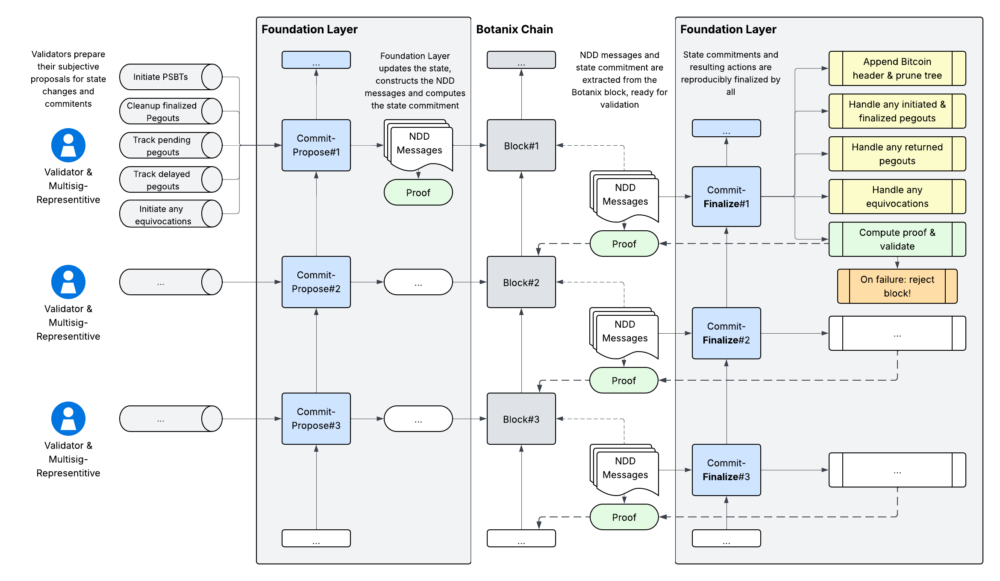
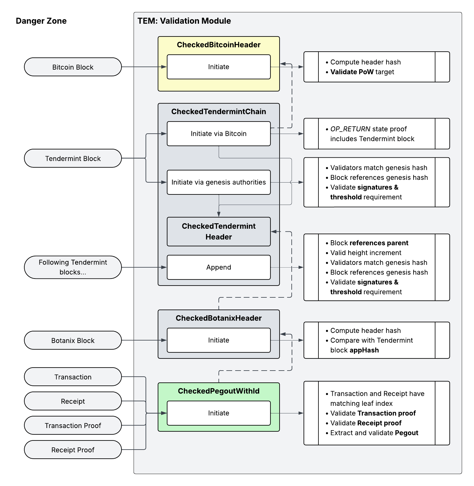

> [!WARNING]
> **This project has been halted until further notice and is archived. No further development or maintenance is planned at this time.**

## Introduction

This repository implements the core infrastructure for the final, hardened version of Botanix — bringing fully secure, decentralized Bitcoin withdrawals (pegouts) to production. It is the engineering realization of the [Dynamic Federation whitepaper](./spec/dynafed.pdf), our primary technical specification, together with the earlier [Proof-of-Concept specification](./docs/initial_spec.md) that established the cryptographic foundations.

The system is built around two interconnected components:

- **Foundation Layer**: a thin state verification layer that manages validator coordination and pegout lifecycle across the distributed multisig system
- **Trusted Execution Machine (TEM)**: an isolated, networkless environment that cryptographically validates and authorizes pegout requests

## Building

This repository is primarily intended to be used as a library. Further structural changes to follow.

To generate the documentation for `botanix_tem`:

```
cargo doc --document-private-items
```

## Foundation Layer

The most important aspect of Botanix is that much of the coordination and validation occurs off-chain in an asynchronous manner. Although users initiate pegouts deterministically through the EVM, the multisig system must handle complex, time-distributed operations: initiating signing rounds, exchanging multiple FROST packages across undefined timelines, and potentially employing batching systems that collect multiple pegouts before constructing PSBT transactions. Furthermore, PSBT transactions may fail or become orphaned on the Bitcoin layer, requiring pending pegouts to be nullified and made spendable again. These moving parts operate on different schedules, and we cannot expect these events to occur simultaneously for all observers. Additionally, validators - who may participate in zero, one, or multiple multisig accounts - cannot reliably track the constantly changing states of all other multisig accounts.

The Foundation Layer serves as a thin state verification layer that manages these critical properties without the complexity of tracking states across a constantly evolving landscape of validator set transitions, multisig account changes, rotations, and a dynamic Bitcoin chain where blocks may be orphaned. Following principles similar to the TEM, the Foundation Layer treats all input as potentially malicious, verifies input through cryptographic proofs, and crucially makes all decisions based solely on provided inputs without requiring access to external networks or resources.

<div align="center">

</div>

The TEM depends on the Foundation Layer for validator state information, while the Foundation Layer operates independently. This unidirectional dependency ensures that the Foundation Layer can function as a standalone validator coordination system while providing the necessary infrastructure for TEM operations.

## Trusted Execution Machine (TEM)

The TEM operates as an isolated, networkless environment without persistent storage, responsible for cryptographically validating and authorizing pegout requests from Botanix users. It treats all input as potentially malicious and validates every piece of data through cryptographic proofs before taking any action.

While the TEM can independently validate the cryptographic legitimacy of individual pegout requests, it depends on the Foundation Layer to understand the broader multisig context. Specifically, the TEM requires knowledge of which multisig setup each pegout should be assigned to, which pegouts have already been processed, and which remain pending. This dependency is essential for preventing double-spend attacks, as the TEM must maintain accurate state about pegout lifecycle management across the distributed multisig system.

The TEM's primary security benefits include:

- **Key Protection**: Botanix validators can deploy the TEM within a Trusted Execution Environment (TEE), ensuring that multisig keys remain secure even if the main Reth node is compromised
- **Sequential Validation**: The pegout validation process operates deterministically with fewer moving parts, making the system significantly easier to test, audit, and reason about
- **Cryptographic Verification**: All trust assumptions are eliminated through comprehensive proof verification

<div align="center">

</div>

### Offline Validation

The validation module serves as the security core for the TEM, implementing a comprehensive trust-but-verify model where all external data must be cryptographically validated before use. This approach is essential for TEE deployment where the system operates without network access or persistent storage capabilities.

The validation module implements a hierarchical "Checked Types" pattern where validated data is wrapped in types that guarantee successful validation:

- `CheckedBitcoinHeader`: Bitcoin header with validated proof-of-work
- `CheckedTendermintHeader`: Tendermint header with validated BFT consensus
- `CheckedBotanixHeader`: Botanix header validated against Tendermint commitment
- `CheckedPegoutWithId`: Pegout with complete multi-layer proof verification

These types prevent direct access to unvalidated data and ensure that only cryptographically verified information is used in downstream processing.

<div align="center">

</div>

The validation system operates under several core principles that ensure security and reliability:

* **Cryptographic Verification**: All trust is based on cryptographic proofs rather than external sources or assumptions
* **Multi-Chain Consistency**: Data consistency is enforced across heterogeneous blockchain systems using their respective proof mechanisms
* **Stateless Operation**: Validation occurs without persistent state, reconstructing all necessary context from provided proofs
* **Deterministic Results**: Identical inputs always produce identical validation outcomes, essential for distributed TEE consensus

The validation module consists of four specialized components, each handling validation for different blockchain systems and operations:

# Roadmap

_Temporary roadmap while this repository remains primarily work-in-progress. This section will be removed later on._

## Foundation Module (`src/foundation/`)

- [x] **Commitment System** (`src/foundation/commitment/`) - Cryptographic state commitment using `trie-db`
  - [x] Entry system with domain-separated keys (`entry.rs`)
  - [x] Sorted data structures for deterministic operations (`sorted.rs`)
  - [x] Low-level trie operations with consistency guarantees (`trie.rs`)
  - [x] Higher-level Botanix state management (`botanix.rs`)
  - [x] Atomic storage operations with transaction semantics (`storage.rs`)
  - [x] Custom node codec for trie encoding/decoding (_forked_) (`node_codec.rs`)
- [x] **Proof System** (`src/foundation/proof.rs`) - Cryptographic state proofs for consensus
  - [x] Foundation state root computation
  - [x] Auxiliary event tracking for efficient lookups
  - [x] State reconstruction capabilities
- [x] **Core Foundation API** (`src/foundation/mod.rs`) - Main interface
  - [x] Two-phase operation model (propose/finalize)
  - [x] Pegout lifecycle management (initiated -> pending -> delayed/finalized)
  - [x] Bitcoin block tree coordination with automatic pruning
  - [x] Deterministic state transitions for consensus
- [ ] Testing
  - [x] Basic unit tests
  - [ ] Comprehensive tests

## TEM Module (`src/tem/`)

- [ ] **Core Implementation**
  - [x] Input validation workflow
  - [ ] Pegout set tracking (_requires Foundation module_)
  - [ ] Frost package signing implementation
  - [ ] gRPC interface
- [x] **Validation Framework**
  - [x] Tendermint chain validation setup
  - [x] Botanix header validation against Tendermint
  - [x] Pegout validation with Merkle proofs
- [ ] Testing
  - [ ] Basic unit tests
  - [ ] Comprehensive tests

## Validation Module (`src/validation/`)

### Bitcoin Validation (`bitcoin.rs`)
- [x] **CheckedBitcoinHeader**
  - [x] Proof-of-work validation with hardcoded difficulty target
  - [x] Block hash computation and verification
  - [x] Minimum difficulty enforcement (based on block 840,000)
- [x] **CheckedBitcoinTransaction**
  - [x] Transaction inclusion proof verification
  - [x] Partial Merkle tree proof validation
  - [x] TXID matching in proof validation
- [x] **Transaction Proof Verification**
  - [x] `verify_transaction_proof` function
  - [x] Merkle root validation
  - [x] TXID inclusion verification
- [ ] Testing
  - [ ] Basic unit tests
  - [ ] Comprehensive tests

### Tendermint Validation (`tendermint.rs`)
- [x] **CheckedTendermintHeader**
  - [x] Individual header validation wrapper
- [x] **CheckedTendermintChain**
  - [x] Genesis validator set bootstrapping
  - [x] Chain continuity validation (parent references)
  - [x] Sequential height increment validation
  - [x] Validator signature verification (≥2/3 voting power)
  - [x] Validator set transition handling
  - [ ] Bitcoin-anchored chain initialization
- [x] **Commit Validation**
  - [x] Commit structure validation
  - [x] Signature cryptographic verification
  - [x] Voting power threshold enforcement
- [ ] Testing
  - [x] Basic unit tests
  - [ ] Comprehensive tests

### Botanix Validation (`botanix.rs`)
- [x] **CheckedBotanixHeader**
  - [x] Cross-chain validation against Tendermint app_hash
  - [x] Header hash computation
  - [x] App hash mismatch error handling
- [x] **Transaction Root Operations**
  - [x] `compute_transactions_root` - Merkle Patricia tree root computation
  - [x] `compute_transaction_proof` - proof generation
  - [x] `verify_transaction_proof` - proof verification
- [x] **Receipt Root Operations**
  - [x] `compute_receipts_root` - Merkle Patricia tree root computation
  - [x] `compute_receipt_proof` - proof generation
  - [x] `verify_receipt_proof` - proof verification
- [ ] Testing
  - [x] Basic unit tests
  - [ ] Comprehensive tests

### Pegout Validation (`pegout.rs`)
- [x] **CheckedPegoutWithId**
  - [x] Multi-layer proof verification (transaction + receipt)
  - [x] Position consistency validation (matching nibbles)
  - [x] Log index bounds checking
  - [x] Tenderming proof validation (`appHash`)
- [x] **Pegout Data Structures**
  - [x] `PegoutWithId` - pegout with unique identifier
  - [x] `PegoutId` - transaction hash + log index identifier
  - [x] `PegoutData` - amount, destination, network
- [x] **Event Log Processing**
  - [x] `extract_pegout_data` function
  - [x] Pegout validation logic
- [ ] Testing
  - [x] Basic unit tests
  - [ ] Comprehensive tests

## Primitives Module (`src/primitives/`)

### Core Data Types (`mod.rs`)
- [x] **BotanixHeader**
  - [x] Complete header structure
  - [x] Hash computation (`hash_slow`)
- [x] **Transaction Types**
  - [x] `TxType` enum
  - [x] `TransactionSigned` structure
  - [ ] `Transaction` structure
  - [ ] `TransactionSigned::hash_slow` implementation
- [x] **Receipt Types**
  - [x] `Receipt`
  - [x] `ReceiptWithBloom`

## Structs Module (`src/structs/`)

### Merkle Patricia Tree (`merkle_patricia.rs`)
- [x] **Core Operations**
  - [x] `compute_root` - trie root computation
  - [x] `compute_proof` - inclusion proof generation
  - [x] `verify_proof` - inclusion proof verification
  - [x] `MerklePatriciaProof` with nibbles and nodes

### Simple Merkle Tree (`merkle_simple.rs`)
- [x] **Core Operations**
  - [x] `compute_root` - CometBFT-compatible Merkle root
  - [x] `compute_proof` - inclusion proof generation
  - [x] `verify_proof` - inclusion proof verification
- [x] **Security Features**
  - [x] Prefix-based hashing (0x00 for leaves, 0x01 for inner nodes)
  - [x] Protection against second pre-image attacks
  - [x] Deterministic tree construction
- [x] **Proof Structure**
  - [x] `MerkleProof` with total leaves, leaf index, and aunt hashes
  - [x] Aunt hash collection in correct order
- [ ] Testing
  - [x] Basic unit tests
  - [ ] Comprehensive tests

### Block Tree (`block_tree.rs`)
- [x] **Core Structure**
  - [x] `BlockTree` with tips, elder, blocks map, best height tracking
  - [x] Confirmation depth configuration
  - [x] Fork handling and resolution
- [x] **Block Management**
  - [x] Block insertion with parent-child relationships
  - [x] Automatic pruning based on confirmation depth
  - [x] Elder (oldest retained block) tracking
- [x] **Pruning Strategy**
  - [x] Forward pruning for finalized blocks
  - [x] Backward pruning for orphaned forks
  - [x] `BlockFate` classification (Finalized vs Orphaned)
- [ ] Testing
  - [x] Basic unit tests
  - [ ] Comprehensive tests
