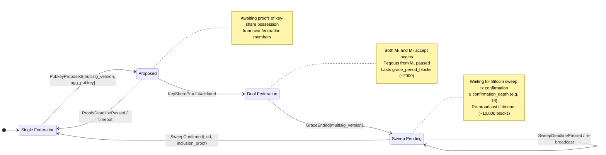

# Federation Migration FSM (Dynafed)

This document defines the finite state machine (FSM) that governs federation migrations
from one multisig (`Mₙ`) to the next (`Mₙ₊₁`) in the Dynafed protocol.

## Purpose
- Describe the protocol states during migration (`Proposed → Dual Federation → Sweep Pending → Single Federation`)
- Specify the on-chain signals and consensus rules that drive transitions

## Context
Each migration is represented by CometBFT events in the Non-Deterministic Data (NDD) section
and validated by the Foundation Layer.  
The FSM ensures these transitions are deterministic and fault-tolerant.

---

## States Overview
| State | Description |
|--------|-------------|
| **Proposed** | A new federation aggregate pubkey (M₂) has been proposed. It awaits on-chain proofs of key-share possession from the next federation’s members. |
| **Dual Federation** | Begins once all proofs are validated. Pegins are accepted to both M₁ and M₂ for a fixed, configurable number of blocks. |
| **Sweep Pending** | The dual-federation period has ended. The final sweep transaction moving remaining funds from M₁ to M₂ is awaiting Bitcoin confirmations. Pegouts remain paused. |
| **Single Federation** | The sweep is confirmed. M₂ becomes the active federation and normal operations resume. |

---

## Signals and Transitions

### Happy Path

| From → To | Trigger (on-chain signal) | Consensus Validation | Notes |
|------------|---------------------------|----------------------|-------|
| **Single Federation → Proposed** | `PubkeyProposed{ multisig_version, agg_pubkey }` | `multisig_version = current + 1 | Coordinator posts the next federation’s aggregate pubkey. If it mismatches the DKG result, new members simply withhold proofs, causing a retry. |
| **Proposed → Dual Federation** | `KeyShareProof{ multisig_version, proof }` for each new federation member | Proof validation is considered a consensus rule | The last validated proof starts the dual-federation period. |
| **Dual Federation → Sweep Pending** | `GraceEnded{ multisig_version }` | `current_height ≥ activation_height + grace_period_blocks` | Pegins to M₁ stop; final sweep transaction is broadcast. |
| **Sweep Pending → Single Federation** | `SweepConfirmed{ multisig_version, txid, inclusion_proof }` | Bitcoin sweep confirmed with ≥ N confirmations | M₂ replaces M₁ as the active federation. |

---

### Failure Path

| From → To | Condition | Consensus Action | Notes |
|------------|------------|------------------|-------|
| **Proposed → Single Federation** | Key-share proofs not completed before `proofs_deadline_height` | State reverts; coordinator re-runs DKG and re-proposes | Prevents indefinite waiting for missing proofs. |
| **Sweep Pending → Sweep Pending** | Sweep not confirmed (at all) before `sweep_deadline_height` | Sweep re-broadcast with adjusted fee | Avoided in practice by using conservative fee rates. |
---

## Parameters & Constants

| Parameter | Description | Example / Range |
|------------|--------------|-----------------|
| `grace_period_blocks` | Duration (in blocks) for which both M₁ and M₂ accept pegins. | 2,000 blocks |
| `proofs_deadline_blocks` | Max blocks allowed for all key-share proofs to be submitted after `PubkeyProposed`. | 200 blocks |
| `sweep_deadline_blocks` | Max blocks after `Dual Federation` ends for the sweep to confirm. | 10,000 blocks |
| `confirmation_depth` | Required Bitcoin confirmations for the sweep transaction. | 18 confirmations |
| `multisig_version` | Incremental federation version number (M₁, M₂, …). | Integer counter |

