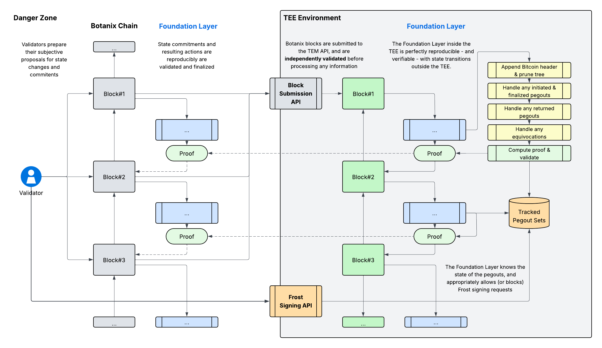

# TEM: Architecture Overview

<div align="center">

</div>

_Work-in-Progress..._

# TEM: Validation Module

> Ref: `src/validation/mod.rs`

The validation module serves as the security foundation for the Trusted Execution Environment, implementing a comprehensive trust-but-verify model where all external data must be cryptographically validated before use. This approach is essential for TEE deployment where the system operates without network access or persistent storage capabilities.

The validation process follows a hierarchical verification pattern where each layer builds upon the security guarantees of the previous layers:

1. **Bitcoin Foundation**: Bitcoin headers are validated for proof-of-work, establishing the root of trust for the Bitcoin chain
2. **Consensus Validation**: Tendermint headers are validated for BFT consensus, ensuring proper validator signatures and chain continuity
3. **Execution Validation**: Botanix headers are validated against Tendermint commitments, ensuring execution layer integrity
4. **Operation Validation**: Pegout operations are validated using proofs from all layers, ensuring end-to-end authorization

The validation module implements a "Checked Types" pattern where validated data is wrapped in types that guarantee successful validation:

- `CheckedBitcoinHeader`: Bitcoin header with validated proof-of-work
- `CheckedTendermintHeader`: Tendermint header with validated BFT consensus
- `CheckedBotanixHeader`: Botanix header validated against Tendermint commitment
- `CheckedPegoutWithId`: Pegout with complete multi-layer proof verification

These types prevent direct access to unvalidated data and ensure that only cryptographically verified information is used in downstream processing.

<div align="center">

</div>

The validation system operates under several core principles that ensure security and reliability:

* **Cryptographic Verification**: All trust is based on cryptographic proofs rather than external sources or assumptions
* **Multi-Chain Consistency**: Data consistency is enforced across heterogeneous blockchain systems using their respective proof mechanisms
* **Stateless Operation**: Validation occurs without persistent state, reconstructing all necessary context from provided proofs
* **Deterministic Results**: Identical inputs always produce identical validation outcomes, essential for distributed TEE consensus

The validation module consists of four specialized components, each handling validation for different blockchain systems and operations:

## Bitcoin Validation

> Ref: `src/validation/bitcoin.rs`

Provides proof-of-work verification and transaction inclusion validation for the Bitcoin blockchain. The module enforces minimum difficulty requirements to prevent acceptance of low-difficulty or fabricated blocks.

**Key Responsibilities:**
- Validates Bitcoin headers meet hardcoded minimum difficulty targets based on block 840,000 (April 2024 halving)
- Verifies transaction inclusion using partial Merkle tree proofs
- Ensures cryptographic integrity of Bitcoin block data

**Security Model:**
```math
\texttt{validPoW}(H) = \texttt{hash}(H) < \phi \land \texttt{target}(H) \geq \tau_{\text{min}}
```

Where $H$ is a Bitcoin header, $\phi$ is the difficulty threshold, and $\tau_{\text{min}}$ is the minimum required target.

## Tendermint Validation

> Ref: `src/validation/tendermint.rs`

Implements BFT consensus validation for CometBFT/Tendermint chains, handling validator signature verification and chain continuity validation.

**Key Responsibilities:**
- Validates that ≥2/3 of voting power has signed each block with cryptographically valid signatures
- Ensures proper block height increments and parent block references
- Handles validator set transitions with proper validation of new validator announcements
- Establishes initial trust from hardcoded genesis validator set hash

**Security Model:**
```math
\texttt{validBFT}(B, V) := \sum_{v \in \texttt{signers}(B)} \texttt{power}(v) \geq \frac{2}{3} \cdot \sum_{v \in V} \texttt{power}(v)
```

Where $B$ is a block, $V$ is the validator set, and all signatures must be cryptographically valid.

## Botanix Validation

> Ref: `src/validation/botanix.rs`

Provides validation for Botanix blockchain data with cross-chain verification against Tendermint consensus commitments.

**Key Responsibilities:**
- Validates Botanix headers against corresponding Tendermint block `app_hash` commitments
- Generates and verifies Merkle Patricia Tree proofs for transactions and receipts
- Computes transaction and receipt tree roots following Ethereum specification
- Bridges execution layer (Botanix) with consensus layer (Tendermint)

**Security Model:**
```math
\texttt{validCrossChain}(H_B, H_T) := \texttt{hash}(H_B) = \texttt{appHash}(H_T)
```

Where $H_B$ is a Botanix header and $H_T$ is the corresponding validated Tendermint header.

## Pegout Validation

> Ref: `src/validation/pegout.rs`

Implements comprehensive validation for Bitcoin withdrawal operations, combining multiple proof systems to ensure end-to-end security.

**Key Responsibilities:**
- Validates transaction and receipt inclusion proofs reference the same tree position
- Extracts and validates pegout data from Ethereum Burn event logs
- Verifies withdrawal amounts and Bitcoin destination addresses
- Ensures pegout authorization through multi-layer proof verification

**Security Model:**
```math
\begin{align}
\texttt{validPegout}(p) := &\texttt{validTxProof}(p) \land \texttt{validReceiptProof}(p) \\
&\land \texttt{samePosition}(p) \land \texttt{validAmount}(p) \\
&\land \texttt{validDestination}(p)
\end{align}
```
