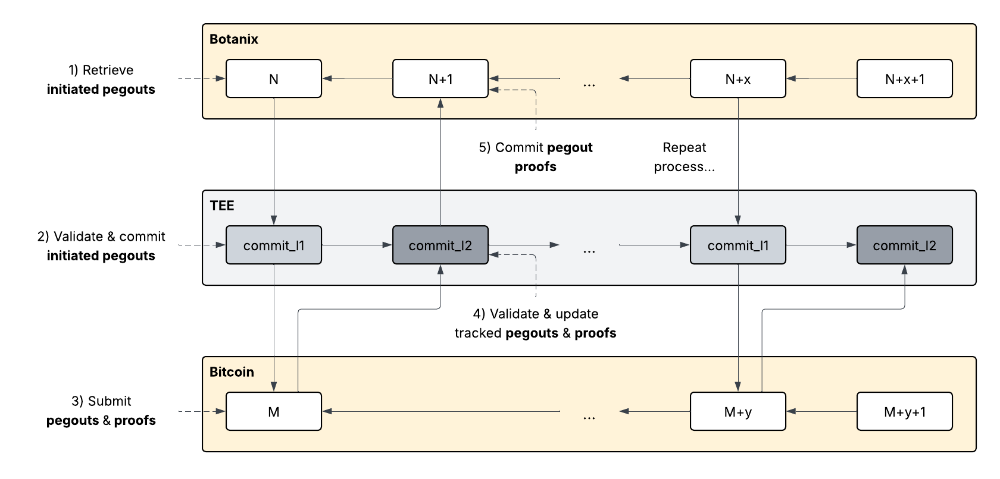
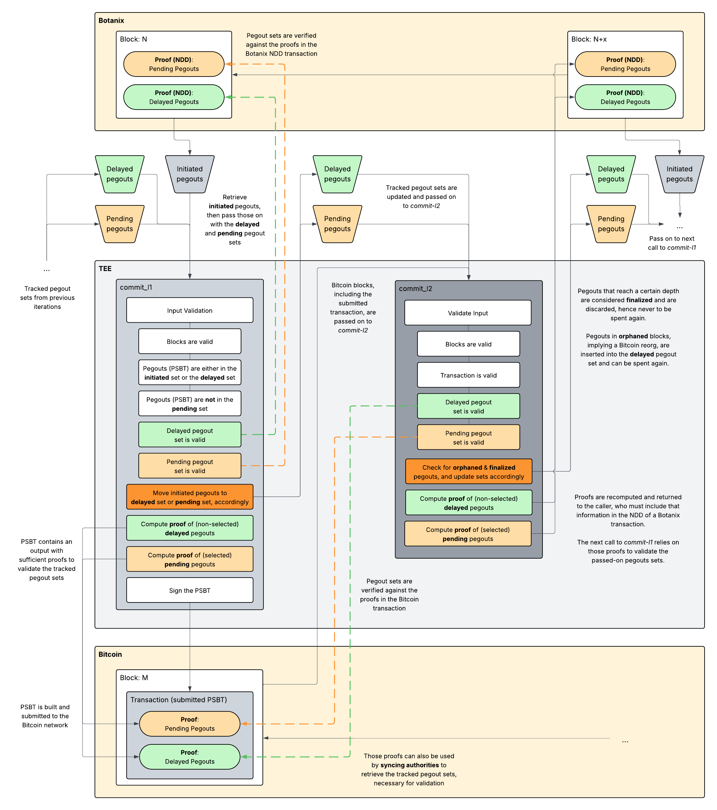

# Pegout Proofs and TEE Environment

> **Disclaimer:** This specification serves as an abstract architectural overview to explain, justify, and discuss key design decisions. It does not cover implementation details, which will be defined after proof-of-concept development.

For this project we aim to make pegout scheduling and state synchronization less error-prone while simplifying the syncing process to require less communication. Most importantly, we need to keep the multisig keys secure in case the Reth node gets exploited by containing the multisig keys within the locked-down Trusted Execution Environment (TEE).

Our current implementation has many moving parts, which makes testing both shaky and tricky, and makes it harder to detect edge cases. By redesigning the system with TEE integration in mind, we can create a more robust and testable architecture. We also assume that the TEE implementation operates under the constraint that it has no networking or storage capabilities. This means the TEE must be able to cryptographically validate all input data and must never sign any provided data without thorough verification.

While our current short-term goal is to ship Pegout proofs with the full TEE implementation planned for later, this document will primarily discuss the TEE in the broader context, assuming that the complete TEE system will eventually be implemented.



## Preliminary Conditions

The Botanix protocol has several core mechanisms that are considered existential, meaning that a failure or bug in these mechanisms would be critical to the protocol's operation. The validation of these core mechanisms must be covered by the TEE:

* **Pegins**: Bitcoin is the main source of entry for Botanix. Users can send Bitcoin to a specific address to mint tokens on Botanix with a 1:1 peg, which is referred to as a "pegin". The mint itself is initiated on Botanix, but the Botanix validators will then verify whether there's a matching Bitcoin L1 transaction before minting the tokens.

* **Pegouts**: The Botanix chain contains a special reserved smart contract that allows users to initiate a pegout event. When such an event is triggered, the validators extract this information and run validation logic, ensuring that the user actually has the desired funds to be withdrawn. If the validation passes, the validators decrease the corresponding Botanix balance and schedule the pegout for the multisig signing process. This means the pegout will generate a corresponding Bitcoin output in the signed PSBT at some point later. Note that pegout scheduling is not directly coupled to Botanix block production.

The **TEE can ignore pegins** since those do not directly require any multisig operations. The validation is handled by the Botanix validators on the Reth side, relying on CometBFT's 2/3 security assumptions.

The **TEE can also ignore Bitcoin inputs** for now, letting the Bitcoin L1 handle this case. In the worst case, the TEE will sign inputs it does not actually own, which the Bitcoin L1 will naturally reject. We can build a separate equivocation system to punish coordinators for such scenarios (note that CometBFT has support for equivocations). This is a subtask for DynaFed and will be prioritized later.

The primary point of failure in this system are the pegouts, so the **TEE must be strict with pegout validation**. Three critical security requirements must be enforced:

1. **Multisig Key Security**: The multisig keys are essential and must be kept secure within the TEE at all times.
2. **Pegout Authorization**: The TEE must verify that each pegout request is valid and must not allow a malicious intruder to arbitrarily request pegouts with the aim to steal funds.
3. **Double-Spend Prevention**: Each pegout must be executed exactly once to prevent double-spend attempts.

## Trusted Execution Machine

The term Trusted Execution Environment (TEE) is an abstract concept that describes an environment where specific security requirements are met. To keep this implementation provider-independent, this section discusses a so-called **Trusted Execution Machine (TEM)** with specified methods and behavior. The goal is that this TEM can run in any TEE capable of executing Rust programs.

The TEM fulfills the following fundamental requirements:

* **Networkless**: The TEM does not require networking access and operates in complete isolation from external network resources.
* **Stateless**: The TEM does not require persistent storage and maintains no state between executions.
* **Single-threaded**: The TEM runs sequentially and does not require multi-threading support.
* **Deterministic**: The TEM is fully deterministic - the same input always produces the same output.

These properties ensure that the TEM can operate securely within the constrained environment of a TEE while maintaining predictable and verifiable behavior.

# TEM Interface

The TEM consists of only two functions, each serving a specific role in the pegout validation process:

* `commit-l1`: Commits **initiated pegouts** from Botanix blocks to the Bitcoin blockchain.
* `commit-l2`: Commits **pending pegouts** from Bitcoin blocks to the Botanix blockchain and handles **finalized pegouts** and **reorganizations**.

These two functions are complementary and operate in a continuous cycle. When initiated pegouts are retrieved from Botanix, they are passed to `commit-l1` along with some additional validation state, which returns an updated state. After these pegouts have been included in a Bitcoin transaction and submitted to the network, the Bitcoin block containing that transaction is passed to `commit-l2` with the updated validation state returned by `commit-l1`, which then again returns another updated state. The entire cycle repeats when new initiated pegouts are retrieved from Botanix.

This bidirectional commitment process ensures that pegout operations are properly validated and tracked across both blockchain networks while maintaining cryptographic proof of authorization at each step.



## Function: `commit-l1`

This method is responsible for committing pegouts from Botanix blocks to the Bitcoin blockchain, as retrieved and validated by the Reth node. The node passes the pegouts to the `commit-l1` method along with a previous commitment state generated by `commit-l2`. If no such commitment exists yet, an initial commitment will be created as described later. This method performs validation and returns a new commitment state.

When the coordinator schedules these pegouts for execution on the Bitcoin network by constructing a PSBT and initiating a signing session, the coordinator includes additional proof data as an `OP_RETURN` output in the PSBT. This proof covers two categories: delayed pegouts that have not yet been scheduled by the pegout scheduler, and pending pegouts on the Bitcoin chain that have not yet reached the required depth and might be reversed. The proof is embedded in the final output, which sends the minimum amount of 546 satoshis to a burn address. Other federation members must validate this final output by deterministically reproducing the same proof.

The commitment state produced by `commit-l1` serves as a cryptographic proof that links the Bitcoin transaction to the validated Botanix pegout requests, ensuring that only authorized pegouts are executed.

### Implementation

Function definition:

```math
\{\epsilon^x, \epsilon^d, \lambda_{\text{sig}}, P^x, P^d\} \leftarrow \texttt{commit-l1}(p^{L1})
```

The input parameter for `commit-l1` is denoted as $p^{L1}$ and defined as:

```math
p^{L1} = \{ T, V, S, P^i, P^x, P^d, \lambda \}
```

where:

```math
\begin{align*}
T &= \{ T_{N-x}, \ldots, T_{N} \}\\
&\quad \text{set of Botanix blocks from height } N-x \text{ up to and including } N\\
V &= \{ V_{N-x}, \ldots, V_{N} \}\\
&\quad \text{set of active validator sets from block } N-x \text{ up to and including } N\\
S &= \{ S_{N-x}, \ldots, S_{N} \}\\
&\quad \text{set of validator signatures from block } N-x \text{ up to and including } N\\
P^i &= \text{set of initiated pegouts after block } N-x \\
P^x &= \text{set of pending pegouts that have not yet reached the finality depth} \\
P^d &= \text{set of delayed pegouts that have not been executed yet} \\
\lambda &= \text{PSBT to be validated and signed }
\end{align*}
```

This input parameter includes all necessary Botanix state transition and validation information from the last retrieved pegouts at block $N-x$ up to and including the latest pegouts at block $N$. This series of blocks must be complete, meaning that each block must be referenced by the next block, forming an unbroken chain. This also implies that some blocks in the chain may not contain any pegouts.

The validation logic must consider validator set transitions and validate the signatures of each block against the active validator set at that block. These signatures and validator set transitions can be retrieved from CometBFT, which offers native support for such mechanisms. The purpose of this function is to verify that the provided blocks are actually valid blocks, ensuring that the retrieved pegouts are valid as determined by CometBFT's 2/3 consensus mechanism.

The pending pegout proof $\epsilon^x$ and the delayed pegout proof $\epsilon^d$ are retrieved from the Botanix block via the NDD, as described in `commit-l2`.

#### Validation Logic

For each $n$:

```math
n \in \{N-x, \ldots, N\}
```

we validate that:

1. The parent block hash of $T_n$ matches the previous block hash, forming a complete chain.
```math
\texttt{parentHash}(T_n) = \texttt{hash}(T_{n-1})
```

2. A sufficient threshold of validators in $V_n$ have generated valid signatures in $S_n$ for block $T_n$.
```math
|S_n| \geq \frac{2}{3} \cdot |V_n| \land \texttt{validSignatures}(S_n, T_n, V_n) = \text{true}
```

Regarding pegouts:

3. The pending pegout set $P^x$ can be verified against proof $\epsilon^x$
```math
\texttt{verifyProof}(\epsilon^x, P^x) = \text{true}
```

4. The delayed pegout set $P^d$ can be verified against proof $\epsilon^d$
```math
\texttt{verifyProof}(\epsilon^d, P^d) = \text{true}
```

5. Each pegout $p$ in $P^i$ has a valid membership proof for being included in a block in $T$
```math
\forall p \in P^i: \exists T_m \in T: \texttt{membershipProof}(p, T_m) = \text{true}
```

6. For each pegout $p$ in the PSBT $\lambda$, $p$ exists in either the initiated pegouts $P^i$ or the delayed pegouts $P^d$:
```math
\forall p \in \lambda: p \in P^i \lor p \in P^d
```

7. **None** of the pegouts in the PSBT $\lambda$ **exist** in the pending pegout set $P^x$
```math
\forall p \in \lambda: p \notin P^x
```

#### State Updates

After validation, we compute new values:

1. Each pegout $p$ in the initiated pegout set $P^i$ that is not used in the PSBT $\lambda$ is inserted into the delayed pegout set $P^d$.
```math
P^d = P^d \cup \{p \in P^i : p \notin \lambda\}
```

2. Each pegout $p$ in the PSBT $\lambda$ that is in the delayed pegout set $P^d$ is removed from that pegout set.
```math
P^d := P^d \setminus \{p \in P^d : p \in \lambda\}
```

3. Each pegout $p$ in the PSBT $\lambda$ is inserted into the pending pegout set $P^x$
```math
P^x := P^x \cup \{p \in \lambda\}
```

4. Generate updated state proof $\epsilon^x$ of all pending (selected) pegouts in $P^x$
```math
\epsilon^x = \text{proof}(\{p \in P^x \})
```

5. Generate updated state proof $\epsilon^d$ of all delayed (non-selected) pegouts, to be scheduled for a later time.
```math
\epsilon^d = \text{proof}(\{p \in P^d \})
```

6. The state proofs $\epsilon^x$ and $\epsilon^d$ are inserted into PSBT $\lambda$ via an `OP_RETURN` output.
```math
\lambda := \lambda \cup \{\texttt{OP\_RETURN}(\epsilon^x, \epsilon^d)\}
```

7. The PSBT $\lambda$ is signed using the multisig key after successful validation.
```math
\lambda_{\text{sig}} = \texttt{sign}(\lambda)
```

The returned commitment state consists of the updated proofs $\epsilon^x$ and $\epsilon^d$, the signed PSBT $\lambda_{\text{sig}}$​, and the updated pegout sets $P^x$ and $P^d$. Those values are then passed on as parameters to `commit-l2`.

```math
\{\epsilon^x, \epsilon^d, \lambda_{\text{sig}}, P^x, P^d\}
```

## Function: `commit-l2`

This method is responsible for committing pending pegouts on Bitcoin to the Botanix chain. While a commitment state output generated by `commit-l1` is always generated once - meaning there cannot be any competing valid commitments and it is considered "final" - we must account for Bitcoin's inherently probabilistic consensus algorithm. A reorganization can result in a different "best chain," which implies that a commitment pending state proof can be undone. For this reason, it's insufficient to only commit the pending state proof to the Botanix chain; we also need a mechanism that determines when the pending state proof is truly considered "final." After a specific time, measured in blocks (depth), we can consider a reorganization to be very unlikely if not practically impossible.

The `commit-l2` method takes the Bitcoin block containing the pending pegouts and the commitment state generated by `commit-l1`. Upon completion, `commit-l2` generates an updated commitment state with the associated proofs. Those proofs are then included to the Botanix chain via the Non-Deterministic Data (NDD) entry. This marks the beginning of the period after which pegouts are considered "spent" and will never be able to be spent again.

The TEM tracks the duration during which it must monitor for potential reorganizations on the Bitcoin chain. If a reorganization is detected, the expenditure of the pegout is considered "undone" and can be spent again. While the tracked duration is active, those pegouts remain in a pending state and cannot be spent.

### Implementation

Function definition:

```math
\{\epsilon^x, \epsilon^d, P^x, P^d\} \leftarrow \texttt{commit-l2}(p^{L2})
```

The input parameter for `commit-l2` is denoted as $p^{L2}$ and defined as:

```math
p^{L2} = \{ T, P^x, P^d, \Lambda \}
```

where:

```math
\begin{align*}
T &= \{ T_{M-x}, \ldots, T_{M} \}\\
&\quad \text{set of Bitcoin blocks from height } M-x \text{ up to and including } M\\
P^x &= \text{set of pending pegouts that have not yet reached the finality depth} \\
P^d &= \text{set of delayed pegouts that have not been executed yet} \\
\Lambda &= \text{the submitted Bitcoin transaction }
\end{align*}
```

Similarily to `commit-l1`, this input parameter includes all necessary Bitcoin state transition and validation information, where $T_M$ is the executed PSBT block. The series of blocks must be complete, meaning that each block must be referenced by the next block, forming an unbroken chain. This also implies that some blocks in the chain may not contain any pegouts.

Bitcoin's probabilistic consensus mechanism relies on computing a block hash that must be below a specific threshold, known as the "difficulty target." This results in Bitcoin block hashes having many leading zeros, proportional to the network's current difficulty level. This property serves as a convenient way for the TEM to validate whether a Bitcoin block represents genuine proof-of-work. **The TEM includes a constant value $\phi$** representing a reasonable difficulty threshold that indicates legitimate Bitcoin blocks. For each Bitcoin block processed, the corresponding block hash can be computed and verified against this threshold. A malicious actor attempting to pass fraudulent Bitcoin blocks to the TEM would need to expend significant computational power to meet this difficulty requirement, making such attacks economically impractical if not impossible. This approach provides an elegant solution for validating the authenticity of Bitcoin blocks without requiring full blockchain verification, leveraging Bitcoin's inherent proof-of-work security model.

The pending pegout proof $\epsilon^x$ and the delayed pegout proof $\epsilon^d$ are retrieved from the Bitcoin transaction $\Lambda$, as described in `commit-l1`.

#### Validation Logic

First we validate that:

1. The Bitcoin transaction $\Lambda$ has a valid membership proof for being included in a block $M$.
```math
\texttt{membershipProof}(\Lambda, T_M) = \text{true}
```

2. The pending pegout set $P^x$ can be verified against proof $\epsilon^x$
```math
\texttt{verifyProof}(\epsilon^x, P^x) = \text{true}
```

3. The delayed pegout set $P^d$ can be verified against proof $\epsilon^d$
```math
\texttt{verifyProof}(\epsilon^d, P^d) = \text{true}
```

For each $m$:

```math
m \in \{M-x, \ldots, M\}
```

we validate that:

4. The parent block hash of $T_m$ matches the previous block hash, forming a complete chain.
```math
\texttt{parentHash}(T_m) = \texttt{hash}(T_{m-1})
```

5. The block hash of $T_m$ meets the difficulty threshold of $\phi$.
```math
\texttt{hash}(T_m) \lt \phi
```

#### State Updates

After validation, we compute new values:

1. If a pegout $p$ in the pending pegout set $P^x$ has a reach the required depth - implying the pegout is _finalized_ - then $p$ is removed from pending set $P^x$.
```math
\forall p \in P^x: \texttt{depth}(p) \geq \mu \Rightarrow P^x := P^x \setminus \{p\}
```
* NOTE: This mechanism is still to be defined.
* NOTE: This mechanism requires a depth-based nullifier in `commit-l1` to prevent double spends!

2. Each pegout $p$ in the pending pegout set $P^x$ that is not in some block in $T$ - implying a reorganization - must be removed from $P^x$ and inserted into the delayed pegout set $P^d$
```math
\begin{align*}
\forall p \in P^x: (\nexists T_m \in T: p \in T_m) \Rightarrow\\
P^x := P^x \setminus \{p\} \land P^d := P^d \cup \{p\}
\end{align*}
```

3. Generate updated state proof $\epsilon^x$ of all pending pegouts in $P^x$
```math
\epsilon^x = \text{proof}(\{p \in P^x \})
```

4. Generate updated state proof $\epsilon^d$ of all delayed pegouts in $P^d$
```math
\epsilon^d = \text{proof}(\{p \in P^d \})
```

The returned commitment state consists of the updated proofs $\epsilon^x$ and $\epsilon^d$ and the updated pegout sets $P^x$ and $P^d$. Those values are then passed on as parameters to `commit-l1`. Additionally, the proofs are then included to the Botanix chain via the Non-Deterministic Data (NDD) entry such that those can be retrieved by `commit-l1`.

```math
\{\epsilon^x, \epsilon^d, P^x, P^d\}
```
